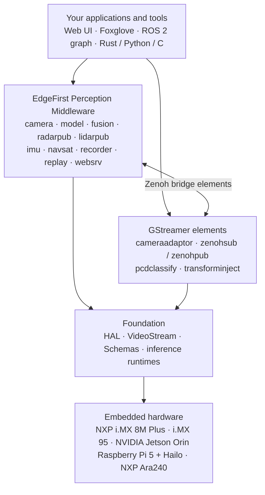
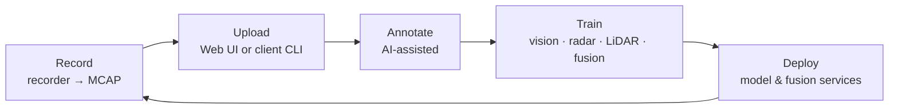

<!-- markdownlint-disable MD033 MD041 -->

  

<!-- studio.png is the generic EdgeFirst hero image despite its filename; it is not Studio-specific. -->

<h1 align="center">EdgeFirst AI</h1>
<h3 align="center">Open-source libraries and microservices for spatial perception on embedded devices</h3>

  <a href="https://doc.edgefirst.ai/latest/perception/">Perception Docs</a> ·
  <a href="zenoh.md">Middleware</a> ·
  <a href="platforms.md">Platforms</a> ·
  <a href="profiler.md">Profiler</a> ·
  <a href="https://edgefirst.studio">EdgeFirst Studio</a> ·
  <a href="https://www.au-zone.com">Au-Zone Technologies</a>

<!-- markdownlint-enable MD033 MD041 -->

---

## What is EdgeFirst Perception?

EdgeFirst Perception is an open-source stack for building camera, radar, and LiDAR perception on embedded Linux. It covers the whole path from sensor capture through NPU inference, multi-sensor fusion, and recording, and it is written for hardware where memory bandwidth and power are the real constraints.

The stack is built around one idea: **don't copy the data**. Camera frames move between processes as DMA-BUF handles, the image and tensor pipeline stays on accelerator-backed buffers, and messages are decoded by borrowing from the wire buffer instead of materializing a new structure.

**ROS 2 in one sentence:** EdgeFirst services publish ROS 2 message definitions in ROS 2 CDR over [Eclipse Zenoh](https://zenoh.io), run without a ROS 2 installation, and join a ROS 2 graph through [`zenoh-bridge-ros2dds`](https://github.com/eclipse-zenoh/zenoh-plugin-ros2dds). They are not an RMW implementation. [Details →](ros2.md)

## How it fits together

Arrows read *builds on*: each layer depends on the one beneath it. Sensor data travels the other way, from hardware up — [How the services connect](zenoh.md#how-the-services-connect) shows that path. Two integration layers sit on one set of Foundation libraries; pick the one that matches how your team already works, or bridge between them.

| Layer | What it is | Start here |
|-------|------------|------------|
| [**Foundation**](foundation.md) | Libraries shared by everything above: zero-copy tensors and image processing, video capture and encoding, message schemas, inference runtimes | [`hal`](https://github.com/EdgeFirstAI/hal), [`videostream`](https://github.com/EdgeFirstAI/videostream), [`schemas`](https://github.com/EdgeFirstAI/schemas) |
| [**Perception Middleware**](zenoh.md) | One process per task, communicating as Zenoh peers with no broker. This is what runs on our platforms | [`camera`](https://github.com/EdgeFirstAI/camera), [`model`](https://github.com/EdgeFirstAI/model), [`fusion`](https://github.com/EdgeFirstAI/fusion) |
| [**GStreamer**](gstreamer.md) | The same perception capabilities as GStreamer and NNStreamer elements, for teams already living in pipelines | [`gstreamer`](https://github.com/EdgeFirstAI/gstreamer) |
| [**ROS 2**](ros2.md) | Interoperable today through the Zenoh DDS bridge; native `rmw_zenoh` support is on the roadmap | [ROS 2 page](ros2.md) |
| [**Profiler**](profiler.md) | A free binary that runs your model on the target and reports accuracy and per-stage timing | [`profiler-cli`](https://github.com/EdgeFirstAI/profiler-cli) |
| [**Platforms**](platforms.md) | Maivin, Raivin, and LiDAR variants such as Maivin+E1R — the middleware composed into production hardware | [Platforms page](platforms.md), [EdgeFirst Modules](https://www.au-zone.com/edgefirstmodules) |

## Why it's different

- **Zero-copy from sensor to model.** V4L2 capture exports DMA-BUF, the camera service shares frames with other processes as file-descriptor handles, and HAL converts and resizes directly on GPU or G2D-backed buffers before they reach the NPU.
- **Borrowing message decode.** `edgefirst-schemas` scans a CDR buffer once to record field offsets, then reads fields in place. Decode cost tracks the number of variable-length fields rather than payload size. On a Raspberry Pi 5, decoding a DRVEGRD-171 radar cube takes 58 ns against 3.4 ms for Fast-CDR and Cyclone DDS. The gap narrows when a subscriber walks the entire payload, and [BENCHMARKS.md](https://github.com/EdgeFirstAI/schemas/blob/main/BENCHMARKS.md) shows both cases.
- **Standard messages, standard tools.** ROS 2 common interfaces, Foxglove schemas, and REP-103 frames with `base_link` transforms on `tf_static`. Recordings are MCAP with the schemas embedded.
- **Composable services.** Maivin, Raivin, and Maivin+E1R run the same binaries; the product is a choice of which services run and how they're configured.
- **Observable.** Services carry [Tracy](https://github.com/wolfpld/tracy) instrumentation that can be switched on at runtime, with near-zero cost until a profiler attaches.

## Getting started

A reasonable path through the stack, roughly in the order teams take it:

1. **Measure your hardware.** `pip install edgefirst-profiler`, point it at a model and a directory of images, and get accuracy plus per-stage timing on the target. No account, nothing uploaded. → [Profiler](profiler.md)
2. **Build a vision pipeline.** `pip install edgefirst-image edgefirst-decoder edgefirst-tracker` for HAL's image processing, YOLO and ModelPack decoding, and ByteTrack — the same code the services use. → [Foundation](foundation.md)
3. **Decode messages in your own code.** `cargo add edgefirst-schemas` or `pip install edgefirst-schemas`. → [Borrowing CDR decode](foundation.md#borrowing-cdr-decode)
4. **Subscribe to a running device.** The [`samples`](https://github.com/EdgeFirstAI/samples) repository and the [Developer Guide](https://doc.edgefirst.ai/latest/perception/dev/) show Rust and Python subscribers for camera, model, radar, LiDAR, IMU, and GPS topics. → [Perception Middleware](zenoh.md)
5. **Run it on real hardware.** Maivin and Raivin ship with the middleware preinstalled and preconfigured, so the whole graph is already running when the device boots. → [Platforms](platforms.md)

Already committed to a framework? [GStreamer](gstreamer.md) and [ROS 2](ros2.md) each have a page of their own.

Repositories carry their own `README.md` and `ARCHITECTURE.md`, with `TESTING.md` and `CONTRIBUTING.md` alongside them in most cases. Full documentation lives at [doc.edgefirst.ai](https://doc.edgefirst.ai/latest/perception/).

## The data loop with EdgeFirst Studio

[EdgeFirst Studio](https://edgefirst.studio) is the companion MLOps platform that closes this loop. Synchronized multi-sensor recordings from the [`recorder`](https://github.com/EdgeFirstAI/recorder) service become datasets, get annotated, train new models, and deploy back to the same services through the [`client`](https://github.com/EdgeFirstAI/client) CLI. The free tier covers the full loop for an individual project — recording, annotation, training, and deployment — and the open-source stack on this page works without it.

## Open source and commercial support

EdgeFirst Perception repositories in this organization are released under the **Apache-2.0** license unless a repository states otherwise. Two components are not open source and say so on their own pages: the [EdgeFirst Profiler](profiler.md#licensing) engine, distributed as a free binary under the EdgeFirst EULA, and the EdgeFirst Fusion Trainer together with the EdgeFirst Fusion Models it produces, which the `fusion` service can optionally run and which are [free to use on Raivin hardware](platforms.md#raivin--camera-and-4d-radar-fusion).

[Au-Zone Technologies](https://www.au-zone.com) offers commercial licensing, custom sensor integration and model optimization, and training for teams building on the stack. Contact us at [au-zone.com](https://www.au-zone.com).

---

<!-- markdownlint-disable MD033 -->

  © Au-Zone Technologies Inc.

<!-- markdownlint-enable MD033 -->
