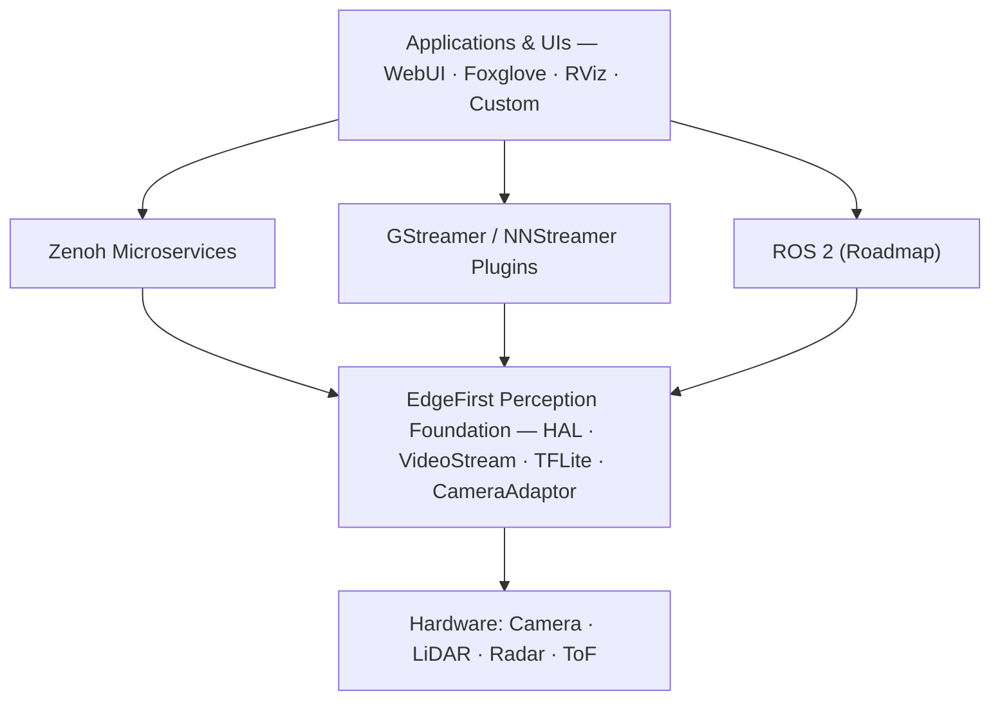

  

<h3 align="center">Open-source libraries and microservices for AI-driven spatial perception on embedded devices</h3>

  <a href="https://edgefirst.studio">EdgeFirst Studio</a> · <a href="https://doc.edgefirst.ai/latest/">Documentation</a> · <a href="https://www.au-zone.com">Au-Zone Technologies</a>

---

## What is EdgeFirst Perception?

**EdgeFirst Perception** is a comprehensive suite of applications and libraries for building AI-driven spatial perception systems on edge devices. It supports cameras, LiDAR, radar, time-of-flight, and other vision-based sensors — enabling real-time object detection, sensor fusion, 3D point cloud processing, and more, all optimized for resource-constrained embedded hardware.

All EdgeFirst Perception libraries are released under the **Apache-2.0 license**.

What sets EdgeFirst apart is performance without compromise. The entire stack is designed around **zero-copy data flow** and **DMA-accelerated pipelines**, eliminating memory copies from sensor capture through inference to inter-service communication — the difference between meeting real-time constraints and missing them on resource-limited hardware.

## Architecture Overview

EdgeFirst Perception is organized into four complementary layers:

| Layer | Description | Status |
|-------|-------------|--------|
| [**Foundation**](foundation.md) | Hardware abstraction, video I/O, and accelerated inference delegates | Stable |
| [**Zenoh Microservices**](zenoh.md) | Modular perception pipeline over Zenoh pub/sub with CDR-encoded messages | Stable |
| [**GStreamer Plugins**](gstreamer.md) | Spatial perception elements for GStreamer and NNStreamer pipelines | Stable |
| [**ROS 2 Integration**](ros2.md) | First-class ROS 2 nodes extending the Zenoh microservices | Roadmap |

## Key Capabilities

- **Multi-Sensor Perception** — Unified abstractions for camera, LiDAR, radar, and time-of-flight sensors with hardware-accelerated capture and processing
- **Zero-Copy & DMA** — End-to-end DMA buffer support eliminates costly memory copies from sensor capture through inference to visualization
- **Edge-Optimized Inference** — NPU-accelerated model execution via TIM-VX and TFLite delegates, purpose-built for i.MX and similar SoCs
- **Sensor Fusion** — Fuse detections across cameras, radar, and LiDAR for robust 3D spatial understanding
- **3D Spatial Data** — Native point cloud and radar cube support across Zenoh, GStreamer, and ROS 2 contexts
- **ROS 2 Compatibility** — CDR-encoded messages and Zenoh transport provide seamless ROS 2 interoperability today, with native integration on the roadmap

## Getting Started

Each layer of EdgeFirst Perception has its own repositories with detailed documentation:

- **Foundation** — Start with [`hal`](https://github.com/EdgeFirstAI/hal) for hardware abstraction and [`videostream`](https://github.com/EdgeFirstAI/videostream) for optimized video I/O. See [Foundation Details →](foundation.md)
- **Zenoh** — The [`schemas`](https://github.com/EdgeFirstAI/schemas) project defines the message types used across all microservices. See [Zenoh Details →](zenoh.md)
- **GStreamer** — The [`gstreamer`](https://github.com/EdgeFirstAI/gstreamer) project provides spatial perception plugins. See [GStreamer Details →](gstreamer.md)
- **ROS 2** — Already interoperable today via the Zenoh bridge; native integration is on the roadmap. See [ROS 2 Details →](ros2.md)
- **Samples** — The [`samples`](https://github.com/EdgeFirstAI/samples) repository provides complete working examples for getting started with EdgeFirst Perception.

Individual repositories include `README.md`, `ARCHITECTURE.md`, `TESTING.md`, and `CONTRIBUTING.md` for in-depth guidance. Full documentation is available at [doc.edgefirst.ai](https://doc.edgefirst.ai/latest/).

## EdgeFirst Studio

[**EdgeFirst Studio**](https://edgefirst.studio) is the companion SaaS platform for the complete perception development lifecycle. A **free tier** is available for individual projects.

- **Dataset management** — Upload MCAP recordings captured by the [`recorder`](https://github.com/EdgeFirstAI/recorder) microservice for centralized dataset curation
- **AI-assisted annotation** — Label camera images, 3D point clouds, and radar data with auto-labeling assistance
- **Model training** — Train and validate perception models using your labeled datasets, with CameraAdaptor integration for edge-optimized export
- **Deployment** — Deploy trained models directly to edge devices running EdgeFirst Perception services via the [`client`](https://github.com/EdgeFirstAI/client) CLI

## EdgeFirst Ecosystem

EdgeFirst Perception is one part of the broader **EdgeFirst AI** platform:

- **[EdgeFirst Studio](https://edgefirst.studio)** — MLOps platform for dataset management, model training, and deployment (free tier available)
- **[EdgeFirst Platforms](https://www.au-zone.com/edgefirstmodules)** — Production-ready hardware modules including the Maivin vision module and Raivin 4D radar+vision module

## Open Source & Commercial Support

EdgeFirst Perception is open source under the **Apache-2.0 license**, developed by **[Au-Zone Technologies](https://www.au-zone.com)**, specialists in deploying AI at the edge.

For teams requiring additional support, we offer:

- **Commercial licensing** — Extended license options for proprietary deployments, including indemnification and safety-critical certification support
- **Custom development** — Sensor integration, model optimization, and full perception pipeline engineering
- **Training & consulting** — Accelerate your team's embedded AI capabilities

Contact us at [au-zone.com](https://www.au-zone.com) to discuss your project.

---

  © Au-Zone Technologies Inc. — Building the future of spatial perception at the edge.

