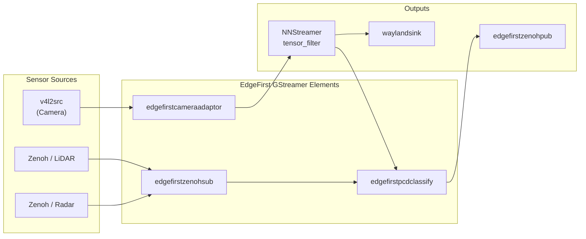

# EdgeFirst Perception for GStreamer

EdgeFirst Perception for GStreamer brings spatial perception to the GStreamer ecosystem — an area that GStreamer's core ecosystem has never addressed natively. Point clouds, LiDAR data, radar signals, and multi-sensor fusion have not been part of the GStreamer plugin landscape. EdgeFirst is building these foundational primitives from the ground up, creating a new category of GStreamer elements for 3D spatial perception on embedded devices.

## Why GStreamer Needs This

GStreamer is the de facto multimedia framework on embedded Linux, with mature infrastructure for buffer management, DMA, hardware acceleration, and pipeline scheduling. Until now, spatial perception — point clouds, radar processing, multi-sensor fusion — has not been part of the GStreamer ecosystem.

EdgeFirst Perception for GStreamer unlocks GStreamer's strengths for spatial perception workloads: deterministic buffer pools, zero-copy DMA negotiation, hardware-accelerated processing, and the vast plugin ecosystem for encoding, streaming, and display. For teams that prefer or already use GStreamer pipelines, EdgeFirst brings the same perception capabilities available through the [Zenoh](zenoh.md) and [ROS 2](ros2.md) layers directly into the GStreamer graph.

## Overview

EdgeFirst Perception for GStreamer is one of three complementary integration layers — alongside [Zenoh microservices](zenoh.md) and [ROS 2](ros2.md) — all built on the same [Foundation](foundation.md) libraries and sharing the same commitment to zero-copy DMA buffer flow. The GStreamer layer is ideal for teams working within GStreamer pipelines, while the Zenoh bridge elements also enable interoperability between GStreamer and the Zenoh microservices.



> Note: `edgefirsttransforminject` attaches calibration metadata inline to buffers flowing through the pipeline — it is not shown as a separate node because it operates as a passthrough element on existing streams.

## New Spatial Data Types for GStreamer

EdgeFirst introduces GStreamer caps and metadata structures that have no precedent in the ecosystem:

| Data Type | Description |
|-----------|-------------|
| **Point clouds** | Custom caps and `GstMeta` for LiDAR, radar, and ToF point cloud data with per-buffer point count, field descriptors, and sensor timestamps. Supports variable-size point clouds in fixed DMA buffer pools for deterministic real-time performance. |
| **Radar cubes** | Caps for raw radar cube data — 4D complex tensors containing range-Doppler FFT output from automotive radar sensors. Enables signal-level radar processing within GStreamer pipelines. |
| **Calibration metadata** | Per-buffer intrinsic and extrinsic transform metadata enabling multi-sensor alignment, coordinate transformation, and projection — equivalent to ROS `tf` but native to GStreamer. |

These foundational types allow point clouds, radar data, and calibration transforms to flow through standard GStreamer pipelines alongside video, leveraging the framework's buffer pools, scheduling, and synchronization infrastructure.

## NNStreamer DMA Enhancements

Our [`nnstreamer`](https://github.com/EdgeFirstAI/nnstreamer) fork introduces a significant architectural improvement to the upstream NNStreamer project:

- **First-class DMA buffer support** — Refactored tensor handling to carry DMA file descriptors natively through the pipeline, eliminating costly `mmap`/`memcpy` operations between elements
- **Zero-copy inference** — Camera frames flow directly from V4L2 capture through ISP to NPU inference without a single CPU-side copy
- **Upstream-intended** — These changes are designed for contribution back to the NNStreamer project and follow upstream coding conventions

NNStreamer's tensor infrastructure — `tensor_mux`, `tensor_filter`, `tensor_transform` — provides the proven foundation for neural network integration. EdgeFirst extends this with DMA-aware tensor handling and new spatial data types that NNStreamer's existing `other/tensors` caps can carry alongside video tensors.

## EdgeFirst GStreamer Elements

The [`gstreamer`](https://github.com/EdgeFirstAI/gstreamer) project provides a suite of elements purpose-built for spatial perception:

### Camera & Inference Pipeline

| Element | Description |
|---------|-------------|
| `edgefirstcameraadaptor` | Hardware-accelerated ML preprocessing — fused color conversion, resize, letterbox, quantization, and layout transformation with DMA-BUF zero-copy. Works with models trained using the [`cameraadaptor`](https://github.com/EdgeFirstAI/cameraadaptor) Python library (see also [Foundation — Model Training & Export](foundation.md#model-training--export)). |

### Zenoh Bridge & Sensor Fusion

| Element | Description |
|---------|-------------|
| `edgefirstzenohsub` | Subscribe to Zenoh topics (PointCloud2, RadarCube, Image) and produce GStreamer buffers with CDR decoding |
| `edgefirstzenohpub` | Publish GStreamer buffers to Zenoh topics with CDR encoding |
| `edgefirstpcdclassify` | Project camera segmentation masks onto point clouds for semantic 3D understanding |
| `edgefirsttransforminject` | Attach calibration metadata (intrinsic/extrinsic transforms) inline to buffers for multi-sensor alignment |

### Post-Processing & Visualization

| Element | Description |
|---------|-------------|
| Detection decoding | Decode model outputs (YOLO, SSD, etc.) into structured detection results |
| Tracking | Object tracking that maintains identity across frames |
| Overlay | Bounding boxes, labels, confidence scores, and point cloud visualization |

## Multi-Sensor Fusion Inside the Pipeline

EdgeFirst's GStreamer elements support sensor fusion directly within the pipeline. This gives GStreamer users the same fusion capabilities available through the Zenoh and ROS 2 layers, without leaving the GStreamer workflow. EdgeFirst's elements handle:

- **Multi-rate synchronization** — Combining 10Hz radar with 30Hz camera requires timestamp-based association beyond GStreamer's standard `GstCollectPads`. EdgeFirst elements handle heterogeneous sensor rates with configurable synchronization policies.
- **In-pipeline coordinate transforms** — Extrinsic calibration, projection onto rectified images, and spatial alignment happen within the GStreamer graph via `edgefirsttransforminject` metadata.
- **Late and mid-level fusion** — Combine processed outputs from camera inference and sensor publishers within a single pipeline, reducing latency compared to inter-process fusion.

## Zero-Copy Buffer Management

EdgeFirst GStreamer elements use pre-allocated DMA buffer pools sized for maximum sensor output, with metadata tracking actual data size. This provides:

- **Deterministic memory** — Fixed pool allocation avoids runtime fragmentation on embedded devices
- **DMA negotiation** — Elements use `memory:DMABuf` caps features and DRM modifiers for zero-copy buffer passing between V4L2, ISP, NPU, and display hardware
- **CMA integration** — Linux `dma_heap` allocation via `/dev/dma_heap/linux,cma` for hardware-contiguous memory on NXP i.MX and similar SoCs

## EdgeFirst Studio Integration

GStreamer pipelines using `edgefirstzenohpub` can publish to the same Zenoh topics consumed by the [`recorder`](https://github.com/EdgeFirstAI/recorder) microservice, enabling MCAP capture of GStreamer pipeline output for upload to [EdgeFirst Studio](https://edgefirst.studio) for dataset management and model retraining.

## Example Pipeline

```bash
gst-launch-1.0 \
  v4l2src ! edgefirstcameraadaptor model-width=640 model-height=640 ! \
  tensor_filter framework=tflite-vx model=yolov8n.tflite ! \
  edgefirstzenohpub topic=detections message-type=detect ! fakesink
```

## Repositories

| Repository | Description |
|-----------|-------------|
| [`gstreamer`](https://github.com/EdgeFirstAI/gstreamer) | EdgeFirst GStreamer elements for spatial perception, Zenoh bridge, sensor fusion, and ML preprocessing |
| [`nnstreamer`](https://github.com/EdgeFirstAI/nnstreamer) | Fork of NNStreamer with first-class DMA buffer support and zero-copy tensor handling |
| [`cameraadaptor`](https://github.com/EdgeFirstAI/cameraadaptor) | Python training library for creating models that accept native camera formats — the training-time companion to `edgefirstcameraadaptor` |
| [`nxp-nnstreamer-examples`](https://github.com/EdgeFirstAI/nxp-nnstreamer-examples) | NNStreamer pipeline examples for NXP i.MX platforms |
| [`imx-gst1.0-plugin`](https://github.com/EdgeFirstAI/imx-gst1.0-plugin) | Fork of NXP's i.MX GStreamer plugin with EdgeFirst enhancements |
| [`gst-plugins-base`](https://github.com/EdgeFirstAI/gst-plugins-base) | Fork of GStreamer base plugins with i.MX DMA optimizations |

---

[Back to Overview](README.md) · [Foundation](foundation.md) · [Zenoh](zenoh.md) · [ROS 2](ros2.md) · [Documentation](https://doc.edgefirst.ai/latest/)
