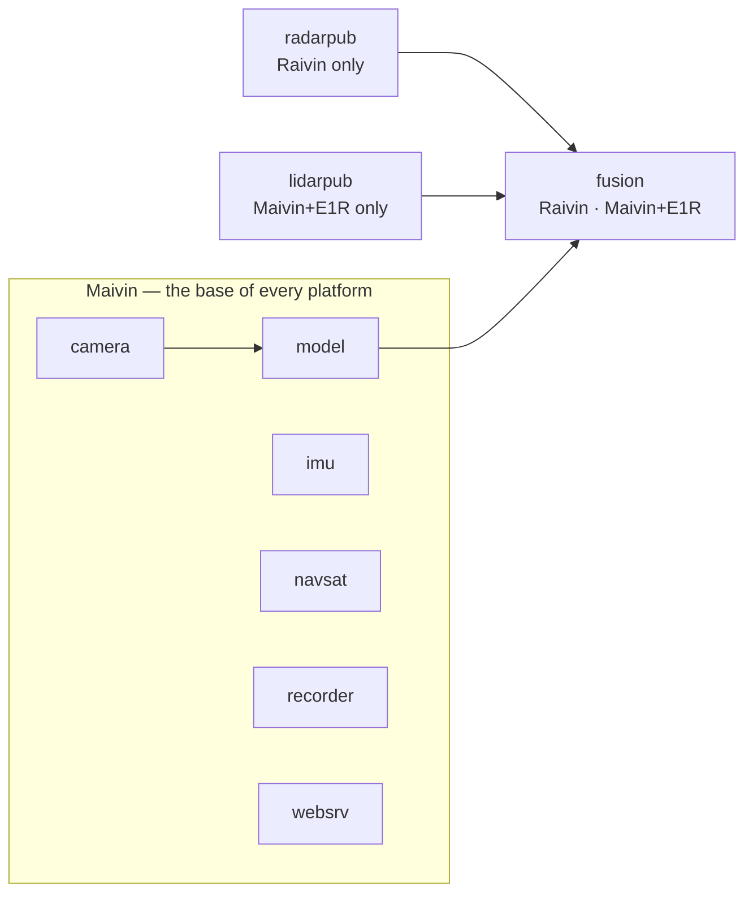

# EdgeFirst Platforms

Our hardware platforms are the [Perception Middleware](zenoh.md) composed into production devices. **Maivin**, **Raivin**, and LiDAR variants such as **Maivin+E1R** run the same open-source service binaries. What differs is the sensors attached, which services are enabled, and how fusion is configured. Ordering and full specifications live on the [EdgeFirst Modules](https://www.au-zone.com/edgefirstmodules) product page.

All three run Torizon for Maivin on an NXP i.MX 8M Plus — a 2 TOPS AI accelerator — with the middleware preinstalled and preconfigured, so the full service graph is running when the device boots. Services run as systemd units under `maivin.target`, and each reads its configuration from `/etc/default/`.

The hardware is built for field deployment rather than the bench: an IP66/67 waterproof enclosure and connectors, and a two-board design that separates the processor board from the image sensor board so the sensor can be changed.

## The platforms at a glance

| | Maivin | Raivin | Maivin+E1R |
|---|---|---|---|
| **Role** | AI vision module | Camera + 4D radar fusion | Camera + LiDAR fusion |
| **Sensors** | Camera, IMU, GNSS | Maivin + smartmicro DRVEGRD-169 imaging radar | Maivin + Robosense E1R LiDAR |
| **Added services** | — | `radarpub`, `fusion` | `lidarpub`, `fusion` |
| **Headline outputs** | `model/output` | `fusion/radar`, `fusion/occupancy`, `fusion/boxes3d` | `fusion/lidar`, `fusion/boxes3d`, `lidar/imu` |
| **Docs** | [Maivin quick start](https://doc.edgefirst.ai/latest/platforms/quickstart/maivin/) | [Raivin quick start](https://doc.edgefirst.ai/latest/platforms/quickstart/raivin/) | [LiDAR module](https://doc.edgefirst.ai/latest/platforms/hardware/lidar/) |

## One set of services, three products

### Maivin — vision

The base platform, and the base every other platform extends.

- `camera` captures from the ISP into DMA-BUF.
- `model` runs detection or segmentation on the NPU with ByteTrack tracking and publishes `model/output`.
- `imu` and `navsat` add orientation and position.
- `recorder` captures synchronized MCAP.
- `websrv` serves the Web UI.

### Raivin — camera and 4D radar fusion

Raivin adds an integrated smartmicro DRVEGRD-169 imaging radar and two services.

- **`radarpub`** ingests the radar over CAN and Ethernet. It publishes `radar/targets`, DBSCAN `radar/clusters`, and optionally the raw `radar/cube`.
- **`fusion`** projects each radar point onto the camera image using `camera/info` and `tf_static`, then labels it with the class and instance of the detection box or mask it lands in. Its outputs:
  - `fusion/radar` — radar points with `vision_class`, `instance_id`, and `track_id`
  - `fusion/occupancy` — an occupancy grid
  - `fusion/boxes3d` — 3D boxes carrying radar range and radial speed

Radar keeps working in rain, fog, dust, glare, and darkness, and it measures velocity directly. Fusion gives those returns semantic labels from the camera.

That is *late* fusion — two processed streams combined after the fact. With the radar cube enabled, `fusion` can also run an **EdgeFirst Fusion Model** on the raw cube and the camera frames together, predicting a bird's-eye-view occupancy grid on `fusion/model_output` from signal-level radar data rather than from detected targets. The cube costs roughly 240 Mbps on the sensor's Ethernet link and a CPU core, so it is enabled only when training or running a Fusion Model.

Fusion Models are trained with the **EdgeFirst Fusion Trainer**, integrated into [EdgeFirst Studio](https://edgefirst.studio). Both the Trainer and the Fusion Models it produces are closed source and **licensed for free use on Raivin hardware**; the `fusion` service that runs them is Apache-2.0 like the rest of the middleware. Ultra-short-range Fusion Models ship with the device under `/usr/share/edgefirst/fusion/`.

### Maivin+E1R — camera and LiDAR fusion

Maivin+E1R adds a Robosense E1R solid-state LiDAR.

- **`lidarpub`** publishes:
  - `lidar/points`
  - `lidar/clusters` (DBSCAN or voxel clustering)
  - `lidar/imu` — readings from the sensor's own IMU, which also drive the IMU-guided ground-plane filter
- **`fusion`** is the same service as on Raivin, configured with a LiDAR input. It publishes `fusion/lidar` with per-point `vision_class`, `instance_id`, and `track_id`, plus `fusion/boxes3d` built from dense LiDAR geometry.

`lidarpub` also supports Ouster OS1 sensors.

## Everything a platform publishes is standard

On every platform:

- Point clouds are `sensor_msgs/PointCloud2`, IMU is `sensor_msgs/Imu`, GPS is `sensor_msgs/NavSatFix`, and intrinsics are `sensor_msgs/CameraInfo`.
- Frames follow REP-103, with each sensor's `base_link` transform on `tf_static`.
- Topics are namespaced by hostname, so several devices can share a network and their recordings can be merged.

That is what lets a platform:

- appear in Foxglove through its MCAP recordings,
- feed a ROS 2 graph through the [Zenoh DDS bridge](ros2.md), and
- feed your own applications through [`schemas`](https://github.com/EdgeFirstAI/schemas).

## From recording to a better model

Every platform closes the same data loop with [EdgeFirst Studio](https://edgefirst.studio):

1. **Record** synchronized camera, radar or LiDAR, IMU, and GPS to MCAP with `recorder`.
2. **Upload** from the Web UI or with the `edgefirst-client` CLI.
3. **Annotate** with AI-assisted ground truth generation.
4. **Train** vision, radar, and LiDAR models, or an EdgeFirst Fusion Model.
5. **Deploy** back to the `model` and `fusion` services on the device.

## Running the services on other hardware

The services aren't tied to our hardware. Beyond Torizon for Maivin, the stack has been brought up and tested on:

- **NXP i.MX 8M Plus** — EVK and FRDM boards
- **NXP i.MX 95** — EVK and FRDM boards

The `model` service runs inference on the i.MX 8M Plus VSI NPU, the i.MX 95 Neutron NPU, and the NXP Ara240 discrete NPU.

More platforms are planned, along with better integration for bringing the services up outside our own images. If you want the stack on a target that isn't listed, [talk to Au-Zone](https://www.au-zone.com) — that feedback is what sets the order.

To measure a model on a target before committing to it, the [Profiler](profiler.md) covers a wider set of hardware and needs nothing else installed.

If you need a sensor we don't support yet, a new platform, or production hardware, [talk to Au-Zone](https://www.au-zone.com).

---

[Overview](README.md) · [Foundation](foundation.md) · [Middleware](zenoh.md) · [Profiler](profiler.md) · [GStreamer](gstreamer.md) · [ROS 2](ros2.md) · [Documentation](https://doc.edgefirst.ai/latest/platforms/)

