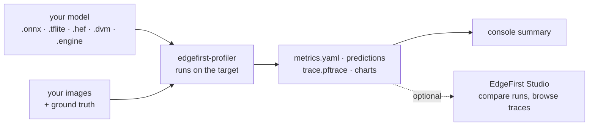

# EdgeFirst Profiler

The profiler answers the question that comes before everything else on this page: **will this model hit its frame budget on this hardware?**

`edgefirst-profiler` is a single native binary that runs the whole vision pipeline — capture, preprocess, inference, postprocess, NMS — on the target device, scores the result against ground truth, and reports how long each stage took. There is no Python on the device and no dependency on the rest of the stack, so it is usually the first EdgeFirst tool a team runs and the one they keep running as models change.

## Install it and point it at a model

```sh
# Linux and macOS
curl -fsSL https://raw.githubusercontent.com/EdgeFirstAI/profiler-cli/main/install.sh | bash

# or, into the Python environment of your choice
pip install edgefirst-profiler
```

```sh
edgefirst-profiler validate --model yolov8n.onnx --images ./val
```

That run writes `metrics.yaml`, per-image predictions, a Perfetto trace, and a console summary to disk. Nothing is uploaded and no account is required.

Windows has a PowerShell installer — wheels for it are not published yet, so `pip` is a Linux and macOS path today. Per-release container images are published to `ghcr.io/edgefirstai/profiler-cli` with the inference runtime already bundled. Running the binary with no arguments opens an interactive dashboard instead of a one-shot run. See [`profiler-cli`](https://github.com/EdgeFirstAI/profiler-cli) for all four distribution paths.

## What it measures



Accuracy and timing are both computed on the device. Publishing to [EdgeFirst Studio](https://edgefirst.studio) is a separate, optional step that lets you compare runs across models, devices, and configurations over time.

| Command | What it does |
|---------|--------------|
| `validate` | Run the pipeline, score it, and write metrics, predictions, and a trace |
| `report` | Print a full summary of any earlier run's `trace.pftrace` |
| `publish` | Upload a finished result set to Studio, separately from measuring it |
| `dispatch` | Run the job on a cloud machine instead of hardware in front of you |
| `system-info` | Print how this machine will be identified, without loading a runtime |

Detection models can run each image as a grid of overlapping tiles rather than one letterboxed frame, which markedly improves recall on small objects. See [Tiled Inference (SAHI)](https://doc.edgefirst.ai/latest/profiler/concepts/sahi/).

## Targets and backends

The model's file extension selects the **runtime family** — `.onnx` loads ONNX Runtime, `.tflite` loads TensorFlow Lite, `.hef` loads HailoRT, and so on. What that runtime then executes on is a separate choice, made by the provider and delegate flags you pass and by which vendor libraries are present. Every vendor library is loaded dynamically, so a runtime missing on one target never breaks the profiler on another.

That distinction matters when reading results: an ONNX model on a CUDA host still runs on the CPU unless you select the CUDA provider.

| Target | Runtime family | Executes on by default | Also available |
|--------|----------------|------------------------|----------------|
| Linux (x86_64, aarch64) | ONNX Runtime | CPU | CPU via TFLite XNNPACK |
| Windows (x86_64) | ONNX Runtime | CPU | — |
| macOS (Apple Silicon) | ONNX Runtime | CPU | Apple GPU / ANE via CoreML |
| NXP i.MX 8M Plus | TFLite | CPU | VSI NPU delegate |
| NXP i.MX 95 | TFLite | CPU | Neutron NPU delegate |
| NVIDIA Jetson Orin | ONNX Runtime | CUDA GPU | TensorRT |
| Raspberry Pi 5 | ONNX Runtime | CPU | Hailo-8 / 8L NPU via HailoRT |
| NXP Ara240 | DVM via `ara2-proxy` | Ara240 NPU | — |

XNNPACK is an optimized CPU kernel library rather than a hardware accelerator; it speeds up CPU inference but does not move work off the CPU.

These are the same targets the [Foundation](foundation.md#supported-hardware) libraries run on, which is not a coincidence: the profiler uses [`hal`](https://github.com/EdgeFirstAI/hal) for accelerated decode and pre/post-processing, so the numbers it reports come from the same code path a deployed pipeline uses.

Per-target setup — runtime libraries, NPU delegates, daemons, and quirks — is in the [Installation guide](https://doc.edgefirst.ai/latest/profiler/installation/).

## Comparing against published baselines

The [EdgeFirst Model Zoo on Hugging Face](https://huggingface.co/spaces/EdgeFirst/Models) publishes benchmarks across Ultralytics and other community models on these same targets, so a local result has something to be measured against. [`yolo-validator`](https://github.com/EdgeFirstAI/yolo-validator) is the open Apache-2.0 reference validator behind those numbers.

## Licensing

The profiler engine is closed source and distributed under the EdgeFirst EULA. The binary is **free to install and run**, including offline validation with no account, and the [`profiler-cli`](https://github.com/EdgeFirstAI/profiler-cli) repository holding the installers and container recipes is public. It is one of two components on these pages that are not Apache-2.0, alongside the [EdgeFirst Fusion Trainer and Fusion Models](platforms.md#raivin--camera-and-4d-radar-fusion) — see [Open source and commercial support](README.md#open-source-and-commercial-support).

---

[Overview](README.md) · [Foundation](foundation.md) · [Middleware](zenoh.md) · [GStreamer](gstreamer.md) · [ROS 2](ros2.md) · [Platforms](platforms.md) · [Documentation](https://doc.edgefirst.ai/latest/profiler/)


