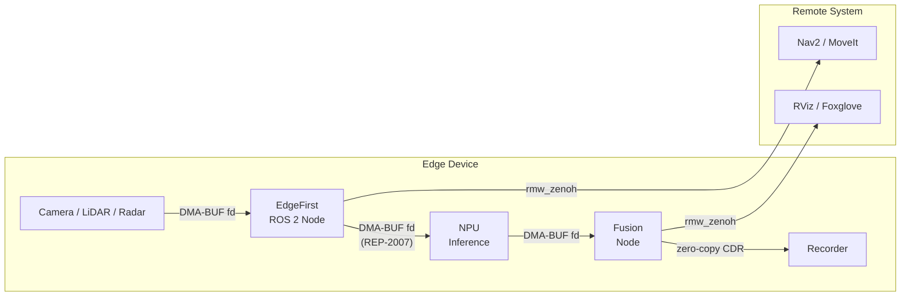
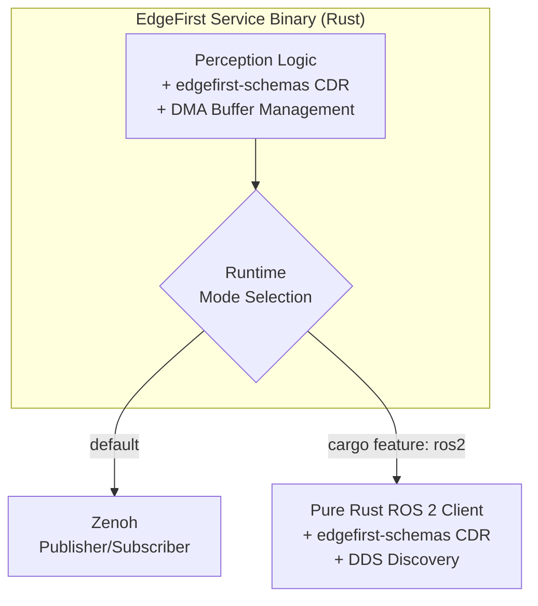

# EdgeFirst Perception for ROS 2

> **Status: Roadmap** — Native ROS 2 integration is planned. The bridge-based integration described under "Current State" is available and in production use today. Everything below "Planned" describes our intended direction.

## Vision

EdgeFirst Perception for ROS 2 will extend the existing [Zenoh microservices](zenoh.md) with first-class ROS 2 integration — native nodes, services, and lifecycle management — while preserving the zero-copy, DMA-accelerated performance that defines the EdgeFirst stack. The goal is to make EdgeFirst Perception indistinguishable from native ROS 2 nodes while delivering embedded-grade efficiency.

For teams building autonomous systems — mobile robots, ADAS applications, industrial equipment, or agricultural machinery — EdgeFirst Perception for ROS 2 will provide production-ready spatial perception that integrates naturally with Nav2, MoveIt, and the broader ROS 2 ecosystem.

## Current State: Bridge-Based Integration

Today, EdgeFirst Zenoh microservices are already ROS 2-compatible through:

- **CDR message encoding** — All EdgeFirst messages use the same binary encoding as ROS 2, handled by [`edgefirst-schemas`](https://github.com/EdgeFirstAI/schemas)
- **Zenoh transport** — The [zenoh-plugin-ros2dds](https://github.com/eclipse-zenoh/zenoh-plugin-ros2dds) bridge transparently exposes EdgeFirst topics to the ROS 2 graph via `zenohd`
- **Standard message types** — Common `sensor_msgs`, `geometry_msgs`, `nav_msgs`, and other ROS 2 types are supported natively
- **Visualization** — EdgeFirst data renders directly in RViz, Foxglove Studio, and PlotJuggler without any conversion
- **`edgefirst_msgs`** — The [`schemas`](https://github.com/EdgeFirstAI/schemas) project already builds as a ROS 2 message package, available today

This approach works well and is in production use today. EdgeFirst Perception for ROS 2 will add native ROS 2 lifecycle nodes with services and parameters, giving ROS 2 teams a fully integrated experience without requiring the external bridge.

## Zero-Copy DMA: The Performance Foundation

A central design goal of EdgeFirst Perception for ROS 2 is **end-to-end zero-copy data flow using Linux DMA buffers** — the same philosophy that drives the Foundation, Zenoh, and GStreamer layers. On embedded devices where memory bandwidth is the primary bottleneck, eliminating copies between sensors, inference engines, and consumers is essential for real-time performance.

### ROS 2 REP-2007 Type Adaptation

ROS 2's [REP-2007](https://ros.org/reps/rep-2007.html) provides the framework for this. Type Adaptation allows ROS 2 publishers and subscribers to work with custom types (like DMA buffer handles) while the middleware handles conversion to standard message types only when necessary — for example, when bridging to a remote node. Within a single process or between co-located nodes using shared memory, data can flow as native DMA buffer file descriptors with no serialization overhead.

EdgeFirst Perception for ROS 2 will implement REP-2007 type adapters for key message types, enabling:

- **Camera frames** passed as DMA-BUF file descriptors from V4L2 capture through ISP processing and NPU inference without a single CPU-side copy
- **Point clouds** from LiDAR and radar shared between fusion and visualization nodes via DMA buffer references
- **Radar cubes** — large 4D complex tensors — exchanged between radar processing and fusion services without memcpy

### EdgeFirst Schemas: Near Zero-Cost CDR

When serialization is required — for recording, remote transport, or bridging to non-DMA-aware nodes — EdgeFirst Perception's [`schemas`](https://github.com/EdgeFirstAI/schemas) library provides a near zero-cost CDR implementation. This is the same library used by the Zenoh microservices today.

The table below compares EdgeFirst's zero-copy borrow operation (which builds an offset index for O(1) field access without deserializing payload data) against a typical full CDR deserialization in Python. These are different operations solving the same practical problem — accessing message fields — but the zero-copy approach avoids allocating or copying any data:

| Operation | EdgeFirst Rust (zero-copy borrow) | Typical Python CDR (full deserialize) | Ratio |
|-----------|----------------------------------|---------------------------------------|-------|
| Access Image fields (FHD) | 144 ns | 165 ms | 1.2B x |
| Access Radar Cube fields (1.5 MB) | 129 ns | 232 ms | 1.8B x |
| Encode Image (FHD) | 2.17 ms (single memcpy) | 699 ms | 322x |
| Decode small messages | 25–166 ns | 51–137 µs | 470–2,000x |

> Borrow cost is **O(1) with respect to payload size** — the wire buffer is never duplicated. See [BENCHMARKS.md](https://github.com/EdgeFirstAI/schemas/blob/main/BENCHMARKS.md) for full results on NXP i.MX 8M Plus.

## Planned: Native ROS 2 Integration

### Direct RMW Integration

EdgeFirst microservices will use `rmw_zenoh` as the ROS 2 middleware layer, allowing them to participate in the ROS 2 graph as first-class nodes — discoverable, introspectable, and manageable through standard ROS 2 tooling — while retaining Zenoh's shared memory transport for on-device communication.

### ROS 2 Lifecycle & Service Support

Each microservice will be implemented as a ROS 2 lifecycle node, enabling:

- `ros2 lifecycle` management for coordinated startup, shutdown, and error recovery
- `ros2 service call` and `ros2 param` for runtime configuration
- Launch file integration with `edgefirst_bringup` for deployment orchestration
- Standard diagnostics publishing for fleet monitoring

### ROS 2 Packages & Existing Repositories

The remaining services will gain ROS 2 support within their existing repositories rather than as separate packages:

| Repository | ROS 2 Integration |
|-----------|-------------------|
| [`schemas`](https://github.com/EdgeFirstAI/schemas) | **Available now** — builds as `edgefirst_msgs` for ROS 2 with the same CDR-encoded message types used by Zenoh services |
| [`camera`](https://github.com/EdgeFirstAI/camera) | Gains ROS 2 lifecycle node with DMA-accelerated ISP and encoding pipelines |
| [`model`](https://github.com/EdgeFirstAI/model) | Gains ROS 2 lifecycle node with NPU-accelerated inference |
| [`fusion`](https://github.com/EdgeFirstAI/fusion) | Gains ROS 2 lifecycle node for multi-sensor fusion |
| [`lidarpub`](https://github.com/EdgeFirstAI/lidarpub) | Gains ROS 2 lifecycle node for LiDAR point cloud publishing |
| [`radarpub`](https://github.com/EdgeFirstAI/radarpub) | Gains ROS 2 lifecycle node for radar point clouds and raw cube data |
| [`recorder`](https://github.com/EdgeFirstAI/recorder) | Gains ROS 2 lifecycle node with [EdgeFirst Studio](https://edgefirst.studio) integration |
| [`replay`](https://github.com/EdgeFirstAI/replay) | Gains ROS 2 lifecycle node for MCAP session replay |
| [`navsat`](https://github.com/EdgeFirstAI/navsat) | Gains ROS 2 lifecycle node for GNSS/GPS data |
| [`imu`](https://github.com/EdgeFirstAI/imu) | Gains ROS 2 lifecycle node for IMU data |
| New: `edgefirst_dmabuf` | REP-2007 type adapters and DMA buffer management for zero-copy transport on supported SoCs |
| New: `edgefirst_bringup` | Launch files, parameter configs, and deployment presets for common scenarios |

### Pure Rust ROS 2 Integration

All EdgeFirst Perception services are written in Rust. Rather than binding to the C-based `rclcpp` / `rcl` stack, the planned ROS 2 integration uses a pure Rust ROS 2 client library (such as [`ros2-client`](https://github.com/Atostek/ros2-client)) that communicates directly with the ROS 2 graph over DDS without any C/C++ dependencies. This approach provides:

- **No C/C++ ROS 2 dependency** — Services compile and link as pure Rust binaries; no `rclcpp`, `rcl`, or ROS 2 installation required at build time
- **Native async/await** — Rust's async runtime replaces the callback-driven model of `rclcpp`, fitting naturally with EdgeFirst's existing Zenoh async architecture
- **EdgeFirst CDR throughout** — The `edgefirst-schemas` zero-copy CDR serializer is used for all message encoding and decoding, replacing the default DDS serialization with our [near zero-cost implementation](https://github.com/EdgeFirstAI/schemas/blob/main/BENCHMARKS.md)
- **Targeting full ROS 2 compatibility** — Topics, services, actions, parameters, lifecycle management, and ROS graph discovery working with standard ROS 2 nodes and tooling (`ros2 topic`, `ros2 service`, `ros2 param`, RViz, Foxglove)

### Runtime Mode Selection

Each EdgeFirst service will support both Zenoh-native and ROS 2 modes from the same codebase:

- **Compile-time feature gate** — ROS 2 support is an optional Cargo feature. When disabled, the binary has zero ROS 2 overhead and no ROS 2 dependencies. When enabled, both transports are available.
- **Runtime transport selection** — With the ROS 2 feature compiled in, a configuration flag or environment variable selects the active transport at startup
- **Identical topics and messages** — Topic patterns and message schemas remain the same regardless of mode; only the transport layer changes
- **Maximum portability** — The same codebase targets systems with or without ROS 2 ecosystems

Teams choose the deployment model that fits their system — Zenoh, ROS 2, or both — without maintaining separate binaries or introducing C/C++ dependencies. Combined with the [GStreamer](gstreamer.md) layer, all three integration paths share the same Foundation libraries and deliver the same perception capabilities.

## Get Involved

We are shaping this layer now and actively seeking input from teams building for autonomous mobile robots, ADAS, industrial, and agricultural applications. Your requirements will help shape the ROS 2 integration.

Reach out to [Au-Zone Technologies](https://www.au-zone.com) to discuss your project, or explore our existing [Zenoh microservices](zenoh.md) and [GStreamer plugins](gstreamer.md) which provide ROS 2 interoperability today. Get started with a free [EdgeFirst Studio](https://edgefirst.studio) account.

---

[Back to Overview](README.md) · [Foundation](foundation.md) · [Zenoh](zenoh.md) · [GStreamer](gstreamer.md) · [Documentation](https://doc.edgefirst.ai/latest/)
