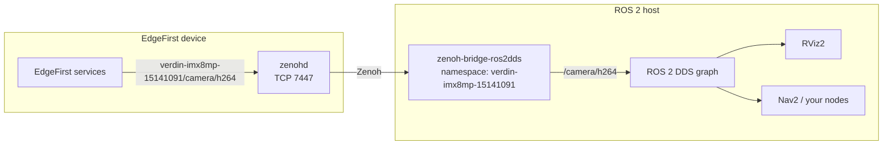

# EdgeFirst Perception and ROS 2

EdgeFirst Perception speaks ROS 2's message language without being a ROS 2 middleware. This page explains exactly what that means, how to use EdgeFirst devices from ROS 2 today, and where we're taking the integration.

## What EdgeFirst is and isn't

| | EdgeFirst Perception today |
|---|---|
| Message definitions | ROS 2 common interfaces (`std_msgs`, `geometry_msgs`, `sensor_msgs`, `nav_msgs`), Foxglove schemas, and `edgefirst_msgs` |
| Encoding | ROS 2 CDR |
| Coordinate frames | REP-103, with `base_link` → sensor transforms on `tf_static` |
| Transport | Native Zenoh pub/sub with hostname-namespaced keys |
| ROS 2 installation on the device | Not required |
| RMW implementation | **No.** Services don't use `rcl` or an RMW, and don't appear as ROS 2 nodes |
| Interoperates with `rmw_zenoh` directly | **No.** `rmw_zenoh` keys carry the domain, type name and type hash; interoperation goes through the DDS bridge. Adopting its wire format is roadmap work |
| Joins a ROS 2 graph | Yes, through [`zenoh-bridge-ros2dds`](https://github.com/eclipse-zenoh/zenoh-plugin-ros2dds) with the device hostname as the bridge's Zenoh namespace |

Why build it this way? A sensor shouldn't need a ROS distribution to publish data. The same services run on devices with no ROS at all, feed our Web UI and MCAP recordings, and still hand ROS 2 systems standard messages when they're connected.

## Using EdgeFirst with ROS 2 today

The hostname namespace is what makes this work. `zenoh-bridge-ros2dds` maps a ROS 2 topic name directly onto a Zenoh key expression — `/camera/h264` becomes the key `camera/h264`, with no type name or hash in the key — which is exactly the key EdgeFirst services publish on. Zenoh's session-level `namespace` then reconciles the device prefix: a session configured with a namespace strips it from every incoming key expression, so a bridge running with the device's hostname sees `camera/h264` and hands ROS 2 a plain `/camera/h264`.

Note that this is the *Zenoh session* `namespace`, a key-expression prefix, not the `ros2dds` plugin's `namespace`, which is a ROS namespace. Only the former accepts the hyphens a device hostname contains.



1. **Enable the router on the device.** `zenohd` is disabled by default. See [Remote Connections](https://doc.edgefirst.ai/latest/perception/dev/#remote-connections).
2. **Run one bridge per device**, with that device's hostname as the Zenoh session namespace:

   ```json5
   {
     namespace: "verdin-imx8mp-15141091",
     mode: "client",
     connect: { endpoints: ["tcp/<device-ip>:7447"] },
     plugins: { ros2dds: { domain: 0 } }
   }
   ```

   ```sh
   zenoh-bridge-ros2dds -c bridge.json5
   ```

3. **Subscribe from ROS 2.** Use RViz2, `ros2 topic echo`, or your own nodes.

One bridge per device keeps devices apart on the ROS 2 side, the same pattern the bridge documents for multi-robot fleets. Stripping the prefix at `zenohd` instead would merge two devices' topics onto the same names, which is the cross-talk the hostname namespace exists to prevent.

> [!NOTE]
> The bridge creates its Zenoh-to-DDS route when it discovers a ROS 2 subscriber, and EdgeFirst services publish no ROS graph liveliness tokens, so a topic may not appear in `ros2 topic list` until something subscribes to it. `ros2 topic echo` creates that subscriber and works. A tested configuration file is still to be published.

### What you get on the ROS 2 side

| Topic | Message type | Works with stock ROS 2 tools |
|-------|--------------|------------------------------|
| `camera/info` | `sensor_msgs/CameraInfo` | Yes |
| `camera/jpeg` | `sensor_msgs/CompressedImage` | Yes, with `image_transport` |
| `radar/targets`, `radar/clusters` | `sensor_msgs/PointCloud2` | Yes, RViz2 PointCloud2 display |
| `lidar/points`, `lidar/clusters` | `sensor_msgs/PointCloud2` | Yes |
| `fusion/radar`, `fusion/lidar`, `fusion/occupancy` | `sensor_msgs/PointCloud2` | Yes; colour by `vision_class` in RViz2 |
| `imu`, `lidar/imu` | `sensor_msgs/Imu` | Yes |
| `gps` | `sensor_msgs/NavSatFix` | Yes |
| `tf_static` | `geometry_msgs/TransformStamped` | Not directly — see below |
| `camera/h264` | `foxglove_msgs/CompressedVideo` | Needs `foxglove_msgs` and a decoder; RViz2 has no H.264 display |
| `model/output`, `model/info`, `fusion/boxes3d`, `radar/cube`, `radar/info` | `edgefirst_msgs/*` | Needs the `edgefirst_msgs` package; no stock RViz2 display |

EdgeFirst publishes `tf_static` as individual `geometry_msgs/TransformStamped` messages. ROS 2's tf2 subscribes to `/tf_static` expecting `tf2_msgs/TFMessage`, which wraps an array of transforms, so **the transforms need an adapter before RViz2 or tf2 will consume them**. Without TF, point clouds will not place correctly in RViz2. Whether the bridge can do that wrapping for you is being confirmed.

### Custom messages: `edgefirst_msgs`

[`schemas`](https://github.com/EdgeFirstAI/schemas) builds as a ROS 2 message package. Add it to your workspace and your nodes can subscribe to `model/output` for detections, masks, and tracks, `fusion/boxes3d` for 3D boxes, and `radar/cube` for raw radar tensors. They get the same types the EdgeFirst services use.

### Recordings

`recorder` writes MCAP with the schemas embedded, and channels are named `/camera/h264`, `/fusion/radar`, and so on. Recordings open in Foxglove with the [EdgeFirst plug-in](https://github.com/EdgeFirstAI/foxglove).

rosbag2 compatibility is a separate question from Foxglove: `ros2 bag` expects its own storage profile and metadata alongside the MCAP, which the recorder does not write today. Whether recordings replay directly through rosbag2 has not been verified.

## What serialization costs

A publisher encodes CDR once. The recorder, the network, and the bridge then move those encoded bytes without re-encoding them — only a subscriber that actually inspects fields pays a decode. [`schemas`](https://github.com/EdgeFirstAI/schemas) makes that decode cheap by reading CDR in place instead of materializing a copy. Against the codecs used by the two major ROS 2 middleware vendors, on a Raspberry Pi 5 ([BENCHMARKS.md](https://github.com/EdgeFirstAI/schemas/blob/main/BENCHMARKS.md)):

| Message | EdgeFirst decode | Fast-CDR | Cyclone DDS |
|---------|------------------|----------|-------------|
| `sensor_msgs/PointCloud2`, Ouster 128-beam | 123 ns | 784 µs | 819 µs |
| `edgefirst_msgs/RadarCube`, DRVEGRD-171 extra long | 58 ns | 3.4 ms | 3.4 ms |
| `foxglove_msgs/CompressedVideo`, 1 MB | 53 ns | 122 µs | 134 µs |

Decode is the cost a subscriber pays before touching the data. A node that reads, modifies, and republishes an entire HD image still pays for walking the pixels; in that workflow the advantage is about 1.9×. Both results are in BENCHMARKS.md.

Inside the device, camera frames skip serialization entirely: they move between processes as DMA-BUF handles. See [what is actually zero-copy](zenoh.md#what-is-actually-zero-copy-and-what-isnt) in the Perception Middleware.

## Roadmap

> [!IMPORTANT]
> Everything below is planned work, not shipped functionality.

We want ROS 2 teams to get EdgeFirst services as first-class participants in their graph without losing the properties that make the stack useful on embedded hardware.

### Goals

- **Discoverable graph participants.** EdgeFirst services appear to `ros2 node list`, `ros2 topic`, and `ros2 param` without an external bridge.
- **Standard lifecycle and parameters.** Lifecycle transitions and parameter services mapped onto each service's existing configuration.
- **No C/C++ ROS dependency.** The services are Rust. ROS 2 support stays an optional Cargo feature, so builds without it carry no ROS 2 code.
- **Same topics, same messages.** Topic names and message types are identical whether a service runs in Zenoh-native or ROS 2 mode. A service runs in one mode or the other, selected at launch — not both at once.
- **Zero-copy preserved, and extended.** Camera frames continue to move as DMA-BUF handles on the device, and serialization happens only where a hop requires it. Going further in a ROS 2 graph is an open question we intend to answer: either through the ROS 2 RFCs covering custom allocators and memory regions, if that is what interoperability requires, or by reusing the [shared-memory support planned for the Zenoh services](zenoh.md#what-is-actually-zero-copy-and-what-isnt) should that work with `rmw_zenoh`. Which of the two applies is still to be determined.
- **`edgefirst_bringup`.** Launch files and presets for Maivin, Raivin, and LiDAR variants.

### Transport: we are going with `rmw_zenoh`

There were two credible ways to reach those goals from pure Rust, and they don't interoperate with each other.

| Approach | Strengths | Trade-offs |
|----------|-----------|------------|
| **Speak the `rmw_zenoh` wire protocol** — its key expressions, liveliness tokens, and attachments — directly from the existing Zenoh sessions | Keeps Zenoh end to end. Matches the Tier-1 Zenoh middleware in current ROS 2 releases. Smallest change to the services | Only interoperates with graphs running `rmw_zenoh`. Must track rmw_zenoh protocol changes across distributions |
| **Native DDS participant** through a pure-Rust ROS 2 client | Works with default DDS-based ROS 2 graphs | Adds a DDS stack to every service. Loses Zenoh's footprint and routing on the device |

**We are taking the `rmw_zenoh` route.** The services are already Zenoh-native, so this is the smallest change: adopt the `rmw_zenoh` wire details in sessions we already open. We would add a native DDS participant if customers running DDS-based graphs ask for it, but Zenoh is the better fit for embedded targets and it is where we already are.

**It will be a mode, not an addition.** A service will run either Zenoh-native, as today, or as an `rmw_zenoh` participant — chosen at launch, publishing under one key scheme at a time. The two cannot be combined, because the key expressions are mutually exclusive. `rmw_zenoh` keys carry the domain, type name and REP-2016 type hash:

```text
0/camera/h264/foxglove_msgs::msg::dds_::CompressedVideo_/RIHS01_…
```

while the bridge route above works precisely because today's keys are the bare topic name. Upstream is explicit that [`rmw_zenoh` cannot interoperate with `zenoh-plugin-ros2dds`](https://github.com/ros2/rmw_zenoh), and no bridge between them exists. So a service in `rmw_zenoh` mode joins an `rmw_zenoh` graph directly and is not reachable through the DDS bridge; a service in Zenoh-native mode is the reverse. Which you want depends on which middleware your robots run.

If you run EdgeFirst hardware alongside ROS 2 — AMRs, agriculture, industrial, ADAS — which RMW your robots use is still the most useful thing you can tell us. [Get in touch](https://www.au-zone.com).

---

[Overview](README.md) · [Foundation](foundation.md) · [Middleware](zenoh.md) · [Profiler](profiler.md) · [GStreamer](gstreamer.md) · [Platforms](platforms.md) · [Documentation](https://doc.edgefirst.ai/latest/perception/)
