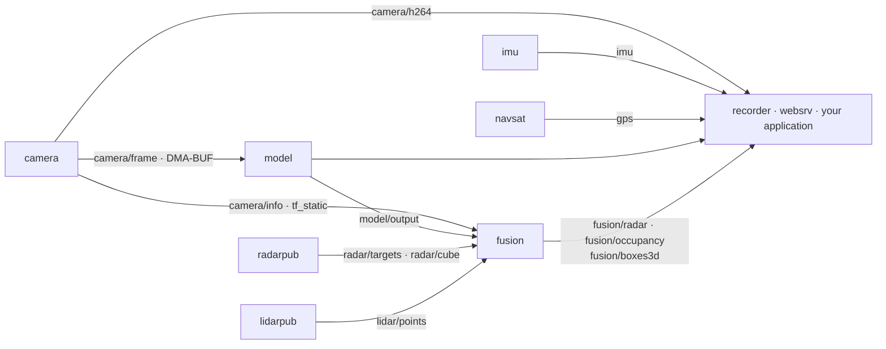

# EdgeFirst Perception Middleware

The Zenoh microservices *are* EdgeFirst Perception as it runs on a device. Each service is an independent process with one job — camera, inference, fusion, a sensor driver, recording — and they talk to one another over [Eclipse Zenoh](https://zenoh.io) using ROS 2 CDR messages from [`schemas`](https://github.com/EdgeFirstAI/schemas). This is the layer our [platforms](platforms.md) ship preinstalled, and the layer most integrations target.

## There is no broker

No central process routes messages. Each service opens its own Zenoh session and the services discover one another through multicast scouting. What distinguishes a service is only which side of the topic space it touches:

- **Publishers** produce topics and consume none — the sensor drivers and `replay`.
- **Publisher-subscribers** consume topics and publish derived ones — `model` and `fusion`.
- **Subscribers** only consume — `recorder`, `websrv`, and your applications.

The practical consequences are what matter. Any service can be stopped, reconfigured, and restarted without touching the others. Several instances can run side by side — one `model` per camera, for example. A service you don't need simply isn't started, and nothing else notices.

The optional `zenohd` router is the one exception, and it is a gateway rather than a participant: it exists so machines off the device can reach the same topics. It is disabled by default.

## How the services connect

This is the superset of every platform, so no single product runs all of it. A Maivin runs the vision path alone, without `radarpub`, `lidarpub`, or `fusion`. A Raivin adds the radar branch; a Maivin+E1R adds the LiDAR branch instead. The binaries are identical in every case — see [Platforms](platforms.md).

## Following one frame through

The chain from photons to a classified 3D point is worth walking, because it is where the architecture earns its keep:

1. **`camera`** captures from the ISP into a DMA-BUF and publishes a `CameraFrame` message carrying its process ID and the file descriptor of each plane. The pixels never enter Zenoh.
2. **`model`** duplicates that descriptor into its own process with `pidfd_getfd`, imports it into [HAL](foundation.md), converts and letterboxes it on the GPU or G2D, runs the NPU inference, decodes boxes and masks, tracks them with ByteTrack, and publishes `model/output`.
3. **`radarpub`** ingests the radar over CAN and publishes `radar/targets`.
4. **`fusion`** projects each radar point onto the camera image using the intrinsics from `camera/info` and the transforms from `tf_static`, labels it with the class and instance of the detection it lands in, and publishes `fusion/radar` plus an occupancy grid and 3D boxes.
5. **`recorder`** writes whichever of those topics you selected to MCAP with the schemas embedded.

Step 2 is the only place the full-resolution frame exists, and it is never copied. Everything after it travels as CDR on the wire — which is cheap for detections and transforms, and less so for point clouds and radar cubes. See [what is actually zero-copy](#what-is-actually-zero-copy-and-what-isnt).

## The microservices

| Repository | Binary | Subscribes | Publishes |
|-----------|--------|------------|-----------|
| [`camera`](https://github.com/EdgeFirstAI/camera) | `edgefirst-camera` | — | `camera/frame`, `camera/h264`, `camera/jpeg`*, `camera/info`, `tf_static` |
| [`model`](https://github.com/EdgeFirstAI/model) | `edgefirst-model` | `camera/frame` | `model/output`, `model/info`, `model/visualization`* |
| [`fusion`](https://github.com/EdgeFirstAI/fusion) | `edgefirst-fusion` | `model/output`, `camera/info`, `tf_static`, `radar/targets` or `radar/clusters`, `lidar/points` or `lidar/clusters`, `radar/cube` + `camera/frame`* | `fusion/radar`, `fusion/lidar`, `fusion/occupancy`, `fusion/boxes3d`, `fusion/model_output`*, `tf_static` |
| [`radarpub`](https://github.com/EdgeFirstAI/radarpub) | `edgefirst-radarpub` | — | `radar/targets`, `radar/clusters`*, `radar/cube`*, `radar/info`, `tf_static` |
| [`lidarpub`](https://github.com/EdgeFirstAI/lidarpub) | `edgefirst-lidarpub` | — | `lidar/points`, `lidar/clusters`*, `lidar/imu`, `tf_static` |
| [`imu`](https://github.com/EdgeFirstAI/imu) | `edgefirst-imu` | — | `imu` |
| [`navsat`](https://github.com/EdgeFirstAI/navsat) | `edgefirst-navsat` | — | `gps` |
| [`recorder`](https://github.com/EdgeFirstAI/recorder) | `edgefirst-recorder` | all or selected topics | MCAP files |
| [`replay`](https://github.com/EdgeFirstAI/replay) | `edgefirst-replay` | — | recorded topics in place of live sensors |
| [`websrv`](https://github.com/EdgeFirstAI/websrv) | `edgefirst-websrv` | topics requested by the browser | configuration, recording, and Studio upload APIs |
| [`webui`](https://github.com/EdgeFirstAI/webui) | browser | via `websrv` over HTTPS and WebSocket | — |

\* Optional, depending on configuration. `radar/cube` and `camera/frame` are consumed by `fusion` only when an EdgeFirst Fusion Model is configured — see [Platforms](platforms.md#raivin--camera-and-4d-radar-fusion).

> [!NOTE]
> `replay` has not yet been migrated to hostname namespaces and EdgeFirst Schemas 4.0. It was not verified for Torizon for Maivin 2026.08. Use Foxglove to review recordings until it is.

## Why Zenoh

- **Small footprint.** No DDS discovery storm, and no ROS 2 installation on the device.
- **Peer, routed, or bridged without changing the binary.** The same service works locally, across a network through `zenohd`, and inside a ROS 2 graph through [`zenoh-bridge-ros2dds`](https://github.com/eclipse-zenoh/zenoh-plugin-ros2dds).
- **The messages ROS 2 already uses.** Payloads are ROS 2 CDR, so a bridged topic is an ordinary ROS 2 topic on the other side. [ROS 2](ros2.md) covers exactly what that does and doesn't mean.

## Topics and namespaces

Services publish on bare keys such as `camera/h264`. Each session sets its namespace to the device hostname, so the key on the wire is `verdin-imx8mp-15141091/camera/h264`.

This does four things: it keeps several devices on one network apart, it makes recordings from multiple devices mergeable, it lets a remote session subscribe to one device or to all of them with `**/camera/h264`, and it lets a ROS 2 bridge strip the prefix per device so two devices never collide on the same ROS topic names. See [ROS 2](ros2.md#using-edgefirst-with-ros-2-today).

The namespace replaces the `rt/` prefix used by earlier releases. Applications still hard-coded to `rt/...` will not receive data.

All frames follow REP-103 — x forward, y left, z up, and z forward for `_optical` frames. Each sensor service publishes its `base_link` transform on `tf_static`.

## What is actually zero-copy, and what isn't

This claim is easy to overstate, so it is worth being precise about where copies do and do not happen.

**The camera frame path is true zero-copy DMA.** The largest payload on the device never enters Zenoh as pixels. `camera` publishes a `CameraFrame` message carrying its process ID and the DMA-BUF file descriptor of each plane; a consumer duplicates the descriptor with `pidfd_getfd`, imports it, converts and resizes on the GPU or G2D, and hands the result to the NPU. The frame is not copied at any step.

Because this passes local file descriptors, `camera/frame` is only available **on the device**, and it is not recorded. `camera/h264` is what leaves the device and what lands in an MCAP file.

**Every other topic is copied onto the wire.** We do not currently use Zenoh's shared-memory transport, so point clouds, radar cubes, and the rest go through the network stack like any other Zenoh payload — even between two processes on the same device.

**What stays zero-copy everywhere is the codec.** [`schemas`](foundation.md#borrowing-cdr-decode) encodes and decodes CDR in place: a subscriber reads fields directly out of the received buffer instead of materializing a new structure, and strings and typed arrays are borrowed from the wire bytes. So a subscriber pays one transport copy and then nothing further, rather than a transport copy plus a full deserialization pass.

That distinction is what the [benchmark numbers](foundation.md#borrowing-cdr-decode) measure — decode, not transport.

**Planned:** full shared-memory support across the microservices is coming in a future update, which will remove the on-device transport copy for the remaining topics — point clouds and radar cubes most of all, since those are the payloads where it costs the most.

## Shared libraries and tooling

| Repository | Description |
|-----------|-------------|
| [`schemas`](https://github.com/EdgeFirstAI/schemas) | Message definitions and the borrowing CDR codec used by every service. See [Foundation](foundation.md#borrowing-cdr-decode) |
| [`foxglove`](https://github.com/EdgeFirstAI/foxglove) | Foxglove extension that decodes `edgefirst_msgs`, including model boxes and segmentation masks over camera video |
| [`samples`](https://github.com/EdgeFirstAI/samples) | Rust and Python applications that subscribe to each topic |

## Reaching topics from other machines

Topics are visible only on the device by default. Enabling `zenohd` (TCP 7447) exposes them on the network:

- **Your applications** — open a Zenoh session to the router and subscribe with `schemas`. See the [Developer Guide](https://doc.edgefirst.ai/latest/perception/dev/).
- **ROS 2** — run the `zenoh-bridge-ros2dds` standalone executable, or load the matching plugin into `zenohd`, with the device hostname as its Zenoh namespace. See [ROS 2](ros2.md#using-edgefirst-with-ros-2-today).
- **Foxglove** — record with `recorder` and open the MCAP file with the EdgeFirst plug-in.

## Recording and the data loop

`recorder` writes MCAP with the schemas embedded, using the publisher's timestamps, and strips the hostname from the channel names: `/camera/h264`, `/model/output`, `/fusion/radar`. A recording opens in Foxglove without the device present, converts to the EdgeFirst Dataset Format with `publisher`, and uploads to [EdgeFirst Studio](https://edgefirst.studio) for annotation and training. Trained models deploy back to the `model` and `fusion` services.

## Profiling

Eight services carry [Tracy](https://github.com/wolfpld/tracy) v0.14.1 instrumentation: `camera`, `model`, `fusion`, `radarpub`, `lidarpub`, `imu`, `navsat`, and `replay`. Enable it at runtime with `TRACY=true` or `--tracy` and attach a profiler from a workstation; nothing is collected until one connects. For measuring a model rather than a running service, see the [Profiler](profiler.md).

---

[Overview](README.md) · [Foundation](foundation.md) · [Profiler](profiler.md) · [GStreamer](gstreamer.md) · [ROS 2](ros2.md) · [Platforms](platforms.md) · [Documentation](https://doc.edgefirst.ai/latest/perception/)
