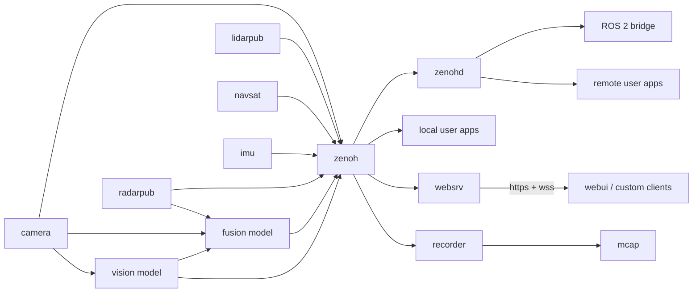

# EdgeFirst Perception for Zenoh

EdgeFirst Perception for Zenoh is a collection of modular microservices that communicate over [Eclipse Zenoh](https://zenoh.io) using CDR-encoded messages. Each microservice handles a single responsibility — camera capture, model inference, sensor fusion, recording — and can be composed into complete perception pipelines through configuration alone.

## Why Zenoh?

Zenoh provides a lightweight, high-performance pub/sub and query transport that is ideal for edge deployments:

- **Low overhead** — Minimal resource footprint compared to full DDS/ROS 2 stacks
- **Shared memory transport** — Zero-copy message passing between co-located services
- **Flexible topologies** — Peer-to-peer, routed, or bridged configurations without code changes
- **ROS 2 compatibility** — CDR message encoding and the [zenoh-plugin-ros2dds](https://github.com/eclipse-zenoh/zenoh-plugin-ros2dds) bridge enable seamless interoperability with ROS 2 systems

## Schemas — The Message Foundation

The [`schemas`](https://github.com/EdgeFirstAI/schemas) project is central to the entire Zenoh microservice architecture. It defines:

- **EdgeFirst message types** — Purpose-built messages for perception data including detections, fused tracks, point clouds, radar cubes, and sensor metadata
- **ROS 2 standard messages** — Common `sensor_msgs`, `geometry_msgs`, and other ROS 2 message types for interoperability
- **Foxglove messages** — Schema-compatible types for direct visualization in [Foxglove Studio](https://foxglove.dev)

All schemas include **optimized serializers and deserializers** for Rust and Python — hand-tuned for minimal allocation and maximum throughput on embedded hardware. The Rust library is available as `edgefirst-schemas` on [crates.io](https://crates.io/crates/edgefirst-schemas) and the Python bindings via pip. See [BENCHMARKS.md](https://github.com/EdgeFirstAI/schemas/blob/main/BENCHMARKS.md) for performance data on NXP i.MX 8M Plus.

## Microservices

| Repository | Description |
|-----------|-------------|
| [`camera`](https://github.com/EdgeFirstAI/camera) | Sensor capture microservice supporting cameras via V4L2 with DMA buffer passthrough and hardware ISP integration |
| [`model`](https://github.com/EdgeFirstAI/model) | Neural network inference microservice with NPU-accelerated execution, automatic pre/post-processing, and multi-model support |
| [`fusion`](https://github.com/EdgeFirstAI/fusion) | Multi-sensor fusion engine that correlates detections across cameras, radar, and LiDAR into unified 3D tracks |
| [`lidarpub`](https://github.com/EdgeFirstAI/lidarpub) | LiDAR sensor publisher supporting point cloud capture and Zenoh distribution |
| [`radarpub`](https://github.com/EdgeFirstAI/radarpub) | Radar sensor publisher for both processed target lists and raw radar cube data |
| [`recorder`](https://github.com/EdgeFirstAI/recorder) | MCAP perception data recorder for capturing synchronized multi-sensor sessions |
| [`replay`](https://github.com/EdgeFirstAI/replay) | MCAP session replay service for offline development, testing, and demonstration |
| [`navsat`](https://github.com/EdgeFirstAI/navsat) | GNSS/GPS navigation service for geolocation and spatial referencing |
| [`imu`](https://github.com/EdgeFirstAI/imu) | Inertial measurement unit service for orientation and motion data |
| [`websrv`](https://github.com/EdgeFirstAI/websrv) | HTTPS web server with Zenoh-to-WebSocket bridge, REST API, and MCAP recording management |
| [`webui`](https://github.com/EdgeFirstAI/webui) | Browser-based visualization platform for live camera streams, AI outputs, point clouds, and system configuration |

## Shared Libraries & Tooling

| Repository | Description |
|-----------|-------------|
| [`schemas`](https://github.com/EdgeFirstAI/schemas) | CDR message definitions with optimized Rust and Python serializers — central to all microservices |
| [`foxglove`](https://github.com/EdgeFirstAI/foxglove) | [Foxglove Studio](https://foxglove.dev) extension plugin that adds support for EdgeFirst custom schemas, enabling visualization of EdgeFirst-specific message types alongside standard ROS 2 data |
| [`samples`](https://github.com/EdgeFirstAI/samples) | Complete working examples for consuming and producing EdgeFirst messages across Rust, Python, and JavaScript |

## Zero-Copy Between Services

Zenoh's shared memory transport enables zero-copy message passing between co-located EdgeFirst microservices. When services run on the same device, large payloads (camera frames, point clouds, radar cubes) are placed in shared memory regions and only a reference is transmitted over Zenoh — the receiving service accesses the same physical memory with no copy. For DMA-backed buffers from hardware sensors, this extends the zero-copy chain from sensor capture all the way through processing to consumption.

For remote communication (between devices or to off-device consumers), Zenoh serializes messages using `edgefirst-schemas` CDR encoding and transmits them over the network via `zenohd`.

## EdgeFirst Studio Integration

Recordings made with the [`recorder`](https://github.com/EdgeFirstAI/recorder) microservice can be uploaded directly to [EdgeFirst Studio](https://edgefirst.studio) for dataset management, annotation, model training, and deployment back to your edge device. Trained models are deployed to the [`model`](https://github.com/EdgeFirstAI/model) microservice via the [`client`](https://github.com/EdgeFirstAI/client) CLI. Studio's free tier supports individual projects; paid plans add team collaboration and CI/CD deployment pipelines.

## ROS 2 Interoperability

EdgeFirst Zenoh microservices are ROS 2-compatible out of the box. Because messages are CDR-encoded and published on Zenoh, the [zenoh-plugin-ros2dds](https://github.com/eclipse-zenoh/zenoh-plugin-ros2dds) bridge transparently exposes them as standard ROS 2 topics. This enables:

- Visualization in RViz
- Integration with ROS 2 navigation and planning stacks
- Mixed deployments where some nodes are EdgeFirst microservices and others are standard ROS 2 nodes

## Architecture

The diagram below shows how sensor publishers feed data through processing services and out to consumers — all connected over Zenoh:

Each microservice is independently deployable, configurable, and replaceable. Compose the pipeline you need by running the services you need — nothing more.

---

[Back to Overview](README.md) · [Foundation](foundation.md) · [GStreamer](gstreamer.md) · [ROS 2](ros2.md) · [Documentation](https://doc.edgefirst.ai/latest/)
